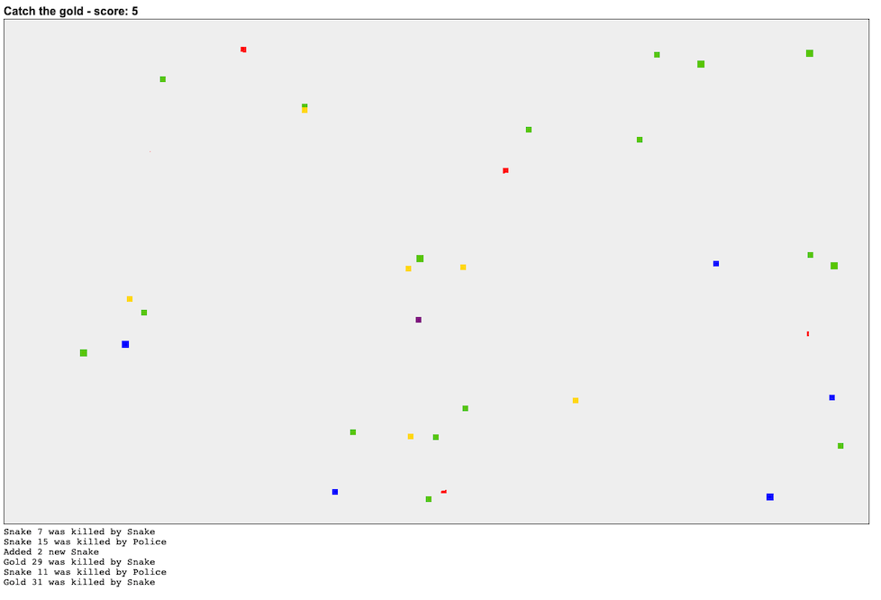

# Animal Game
2D browser board game, with Java-backend. 
Catch the gold items, while running from the snakes (yellow) and police (blue).

# Technology stack
* Java 17
* Spring Boot
* WebSockets
* JQuery & HTML 

# How to start
Prerequisites: installed applications: 
- Java JDK 11 or up (tested with 14, 15, 17) 
- Maven 3

Start application Java back-end by:
* Compiling it firstly, by executing: `mvn package`
* Starting it by executing: `java -jar target/animal-game-0.0.1-SNAPSHOT.jar`

Start application in front-end by:
* Open your browser
* browse to the exact location of the files, by adjusting the following path: 
`file:///location-of-files/html/index.html`

# Game Controls
You can control your own animal (purple color) by using the arrow keys on your keyboard.
If you hit a gold item, you get rewarded with 1 point.

# About me
I am a Java Developer. I just created this game for fun and for experimenting with Websockets. 
Feel free to play or use it.

# License
See LICENSE.md file
